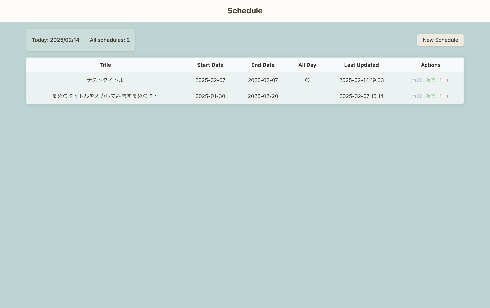
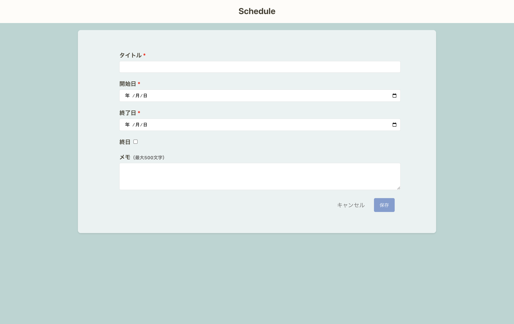
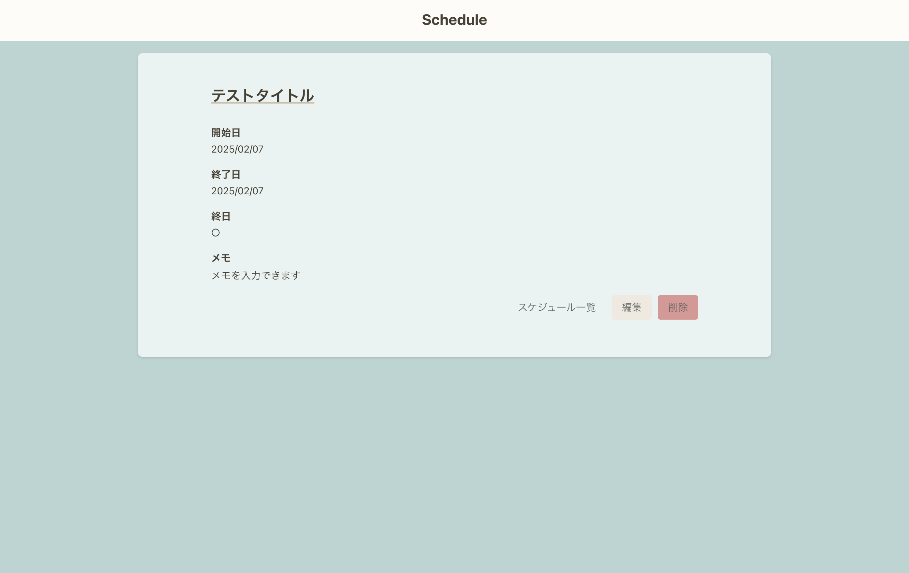
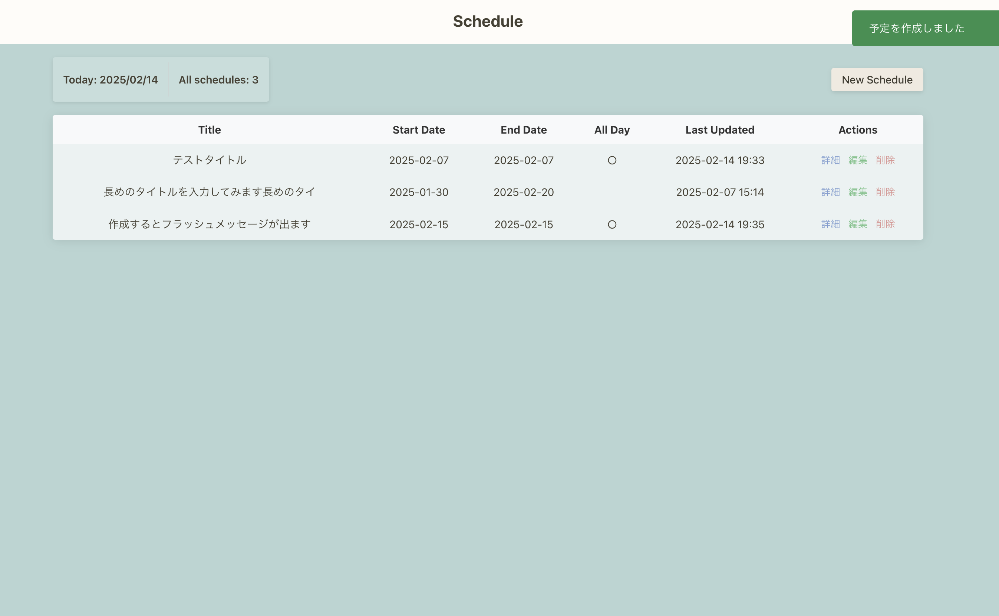

# Scheduler App

## Overview
Schedule App is a simple web application built with Ruby on Rails that allows users to manage their schedules efficiently. Users can create, read, update, and delete schedule entries with validations to ensure data integrity.

## Features
- **CRUD Operations**: Users can create, view, edit, and delete schedules.
- **Data Validation**:
  - Title, start date, and end date are required fields.
  - Title has a maximum length of 20 characters.
  - End date must be after or equal to the start date.
  - Schedule memo can contain up to 500 characters.
- **Confirmation Modal**: When deleting a schedule, a confirmation prompt appears.
- **Flash Messages**: Displays success or error messages upon creating/updating schedules.
- **Formatted Date Display**: Dates are displayed in `YYYY/MM/DD` format.

## Screenshots
### Schedule List


### Schedule Form


### Schedule Details


### Flash Message after Editing


## Technologies Used
- Ruby on Rails 6.1.3.2
- Bootstrap
- SQLite

## Setup
To run this project locally, follow these steps:

```sh
git clone <repository-url>
cd schedule_app
bundle install
rails db:create db:migrate
rails s
```
Then, open `http://localhost:3000` in your browser.

## Future Improvements
- Implement datetime picker for date selection.
- Improve error handling and user feedback.

## License
This project is licensed under the MIT License.
